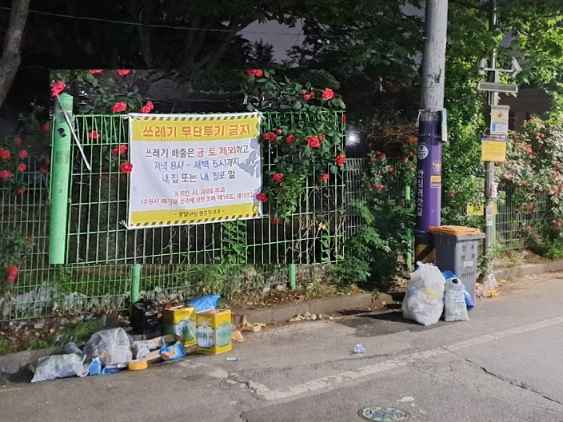

# AI CCTV
2025 ITSW 창의융합아이디어 발표회
<small>환경 문제 해결을 위한 스마트 기술</small>

---

# AI CCTV
우리 동네 환경 지킴이가 지켜보고 있다.

---

# 문제 인식 배경
- 가로등 주변, 골목길은 **쓰레기 무단 투기의 명소**가 됨
- 쓰레기 무단 투기는 몰래 행하거나 어두운 시간대에 버리기 때문에 **실시간 단속**이 어려움
- 쓰레기 방치 → 악취·위생 문제, 도시 미관 훼손, 주민 불만
- 행정 대응 또한 단속하기 힘들고, 한 장소에 오래 머물수 없음

| 문제 | 설명 |
| --- | --- |
| 쓰레기 무단 투기 | 가로등 주변, 골목길에서 자주 발생 |
| 실시간 단속 어려움 | 몰래 행하거나 어두운 시간대에 버리기 때문에 단속이 힘듦 |
| 쓰레기 방치 문제 | 악취, 위생 문제, 도시 미관 훼손, 주민 불만 유발 |

#### 실시간 단속을 하지 않으면 계속해서 반복된다

---

# 아이디어 개요
- **AI CCTV**를 활용하여 쓰레기 무단 투기를 실시간으로 감지하고 단속
- CCTV 카메라에 **AI 모델**을 탑재하여 쓰레기 투기 행위를 인식

사람이 쓰레기를 버리는 동작과 봉투/물건(쓰레기)의 형태, 야간 행동 패턴 등을 학습한 **AI가 CCTV나 카메라와 연동**된다.

영상 속에서 사람과 쓰레기 봉투를 탐지하고, 버리는 동작까지 인식해 무단 투기 상황으로 판단되면 **경고음**을 울린다.

동시에 해당 **영상을 자동 저장**하여 증거로 활용한다. 수집된 영상과 위치, 시간 정보는 DB에 기록되며 이후 **무단 투기 탄생 지역과 시간대 분석**에도 활용

---

<!-- _class: lead -->
집 앞 도로.

---

# 사용 기술
- 딥러닝 기반 **행동 인식 모델** (YOLO, OpenPose 등)
- 영상 분석 + IoT 카메라 연동
- **실시간 경고 시스템** (스피커, 알림 등)
- **데이터베이스** 구축 (영상, 위치, 시간 기록)

---

# 사용 기술

1. **객체 탐지 모델**: YOLOv8 (You Only Look Once version 8)
    - YOLO는 영상 속 객체(사람, 쓰레기 봉투, 박스 등)를 실시간으로 빠르게 탐지하는 모델
    - YOLOv8은 경량화되었고 정확도와 속도 면에서 균형이 잘 맞아, **실시간 CCTV 영상 분석에 적합**
    - 사람과 쓰레기류를 구분 탐지하여 `“사람이 쓰레기를 들고 있는 상태”`를 먼저 인식

2. **행동 인식 보조**: MediaPipe 또는 LSTM 기반 모델
    - YOLO는 정적인 객체만 탐지하므로, 버리는 동작은 프레임 간 시간 흐름을 분석하는 **행동 인식 모델**이 보완해야함
    - Google의 MediaPipe는 **실시간**으로 사람의 관절(포즈)을 추적할 수 있음 → 상체를 숙이거나, 팔을 아래로 뻗는 동작, 무언가를 집어던지는 동작 등을 감지 가능
    - 또는 YOLO로 추출된 프레임 시퀸스를 LSTM(Long Short-Term Memory)에 넣어 행동 시퀸스 기반 판단도 가능

---

3. **이상 판단 및 경고 시스템**
    - `“사람 + 쓰레기 봉투”` 탐지 후, 일정한 **행동 패턴**(예: 팔이 아래로 이동, 쓰레기 소실 등)이 감지되면 **무단 투기 의심**
    - 판단 즉시 경고음 출력, 영상 저장, 시간·장소 기록(관리자 웹에서 확인)

4. **데이터 저장 및 분석**
    - 저장된 영상과 로그 데이터 기반으로 시간대·장소별 무단 투기 데이터 분석
    - 이를 통해 우범지역 패턴 파악 및 예방

---

# 기대효과 및 활용방안
- **주 대상**: 지자체, 공공기관, 건물 관리 업체 등

- **도시 미관 및 위생 문제 개선**

- **무단 투기 감소** → 감시 사각지대 줄어듦

- **행정 대응 효율화**: 증거 확보 → 과태료 부과, 반복 지역 집중 대응

- 수집된 데이터를 통해 지역별 맞춤 정책 수립 가능

---

# 시연
가능하면 해봄

---

# 결론
- AI CCTV를 활용한 **스마트 환경 관리** 시스템
- 실시간으로 쓰레기 무단 투기를 감지하고 대응하여 도시 환경 개선